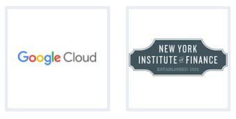
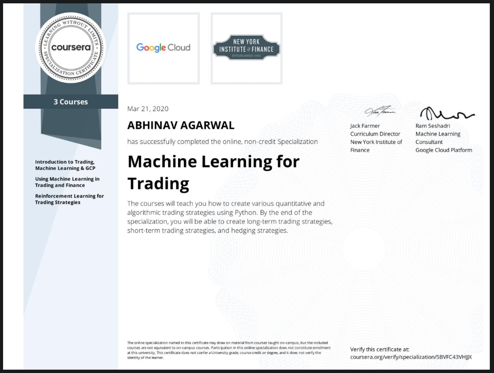

<!--
*** Thanks for checking out the Best-README-Template. If you have a suggestion
*** that would make this better, please fork the repo and create a pull request
*** or simply open an issue with the tag "enhancement".
*** Thanks again! Now go create something AMAZING! :D
-->

<!-- PROJECT SHIELDS -->
<!--
*** I'm using markdown "reference style" links for readability.
*** Reference links are enclosed in brackets [ ] instead of parentheses ( ).
*** See the bottom of this document for the declaration of the reference variables
*** for contributors-url, forks-url, etc. This is an optional, concise syntax you may use.
*** https://www.markdownguide.org/basic-syntax/#reference-style-links
-->

[![Forks][forks-shield]][forks-url]
[![Stargazers][stars-shield]][stars-url]
[![Issues][issues-shield]][issues-url]
[![MIT License][license-shield]][license-url]
[![LinkedIn][linkedin-shield]][linkedin-url]

<!-- PROJECT LOGO -->
 

  

  <h3 align="center">Machine Learning For Trading Specialization</h3>

  

This repository talks about my learnings through coursework and projects that I completed in Google Cloud Machine Learning for trading specialization.
  

# Table of contents

- [About The Specialization](#about-the-specialization)
- [List of Courses and Things Learnt](#list-of-courses-and-things-learnt)
- [Important Projects](#important-projects)

<!-- ABOUT THE PROJECT -->
## About The Specialization

  

Machine Learning for trading is an intermediate level 3-course specialization offered by Google Cloud Platform and New York Institute of Finance. This specialization teaches to construct effective trading strategies using Machine Learning (ML) and Python. It also teaches one use the capabilities of Google Cloud to develop and deploy serverless, scalable, deep learning, and reinforcement learning models to create trading strategies.

### Built With

I learned and made use of the following Python libraries and Google Cloud Tools in this specialization:

* [TensorFlow](https://www.tensorflow.org/)
* [SciPy](https://www.scipy.org/)
* [Matplotlib](https://matplotlib.org/)
* [Pandas](https://pandas.pydata.org/)
* [Google BigQuery](https://cloud.google.com/bigquery)
* [Google AutoML](https://cloud.google.com/automl)
* [Auquan](https://toolbox.auquan.com/)

<!-- GETTING STARTED -->
## List of Courses and Things Learnt

### Course 1. [Introduction to Trading, Machine Learning & GCP](https://www.coursera.org/account/accomplishments/certificate/U84AYW4VTEQK)
 
*  Fundamentals of trading, including the concept of *trend, returns, stop-loss, and volatility*
* Introduction to Jupyter Notebooks hosted on GCP.

### Course 2. [Using Machine Learning in Trading and Finance](https://www.coursera.org/account/accomplishments/certificate/42Z3GFG2GRLF)

* Introduction to *quantitative trading, pairs trading, and momentum trading* strategies. Building models using these strategies.
* *Back testing* above strategies.

### Course 3. [Reinforcement Learning for Trading Strategies](https://www.coursera.org/account/accomplishments/certificate/QWCQM7FM45HZ)

* *Reinforcement Learning* introduction, application of RL in trading strategies.
* Application of *Long Short Term Memory (LSTM)* to *time series data*. 
* Differentiation between *actor-based policies* and *value-based policies*.

<!-- USAGE EXAMPLES -->

## Important Projects

This specialization involves working on a total of 5 projects. The following are 2 of the more interesting projects:

### Apple Closing Price Prediction
[Notebook](notebooks/aapl_regression_scikit_learn.ipynb) Build a simple linear regression model to predict the closing AAPL stock price and backtest to minimize the RMSE error.

### Use Aquauan Toolbox to trade using momentum and mean reversion

[Notebook](notebooks/momentum_backtest_losing_money.ipynb) Perform trades using mean reversion and momentum trading strategies. Perform back testing using Aquanan Toolbox. This notebook can be used as a bot for algorithmic trading.

<!-- MARKDOWN LINKS & IMAGES -->
<!-- https://www.markdownguide.org/basic-syntax/#reference-style-links -->

[forks-shield]: https://img.shields.io/github/forks/anshabhi/gcloud-trading-machine-learning.svg?style=for-the-badge
[forks-url]: https://github.com/anshabhi/gcloud-trading-machine-learning/network/members
[stars-shield]: https://img.shields.io/github/stars/anshabhi/gcloud-trading-machine-learning.svg?style=for-the-badge
[stars-url]: https://github.com/anshabhi/gcloud-trading-machine-learning/stargazers
[issues-shield]: https://img.shields.io/github/issues/anshabhi/gcloud-trading-machine-learning.svg?style=for-the-badge
[issues-url]: https://github.com/anshabhi/gcloud-trading-machine-learning/issues
[license-shield]: https://img.shields.io/github/license/anshabhi/gcloud-trading-machine-learning.svg?style=for-the-badge
[license-url]: https://github.com/anshabhi/gcloud-trading-machine-learning/blob/master/LICENSE
[linkedin-shield]: https://img.shields.io/badge/-LinkedIn-black.svg?style=for-the-badge&logo=linkedin&colorB=555
[linkedin-url]: https://linkedin.com/in/mrabhinavagarwal
